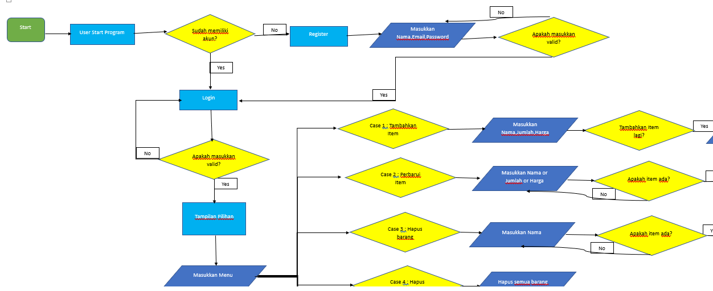
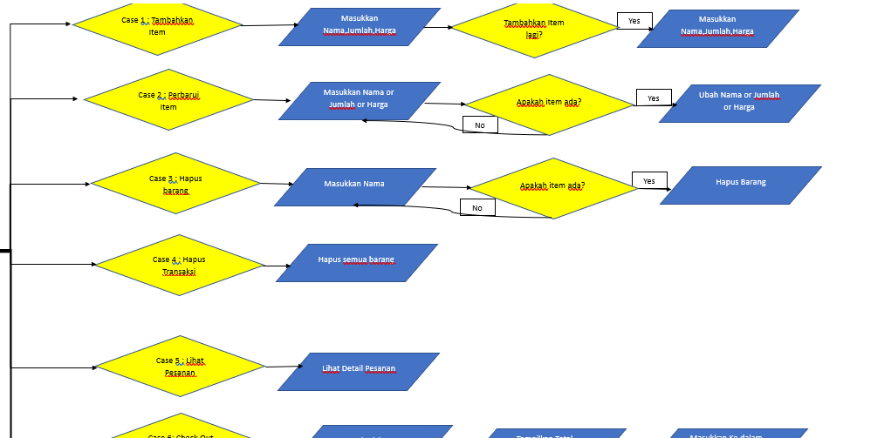
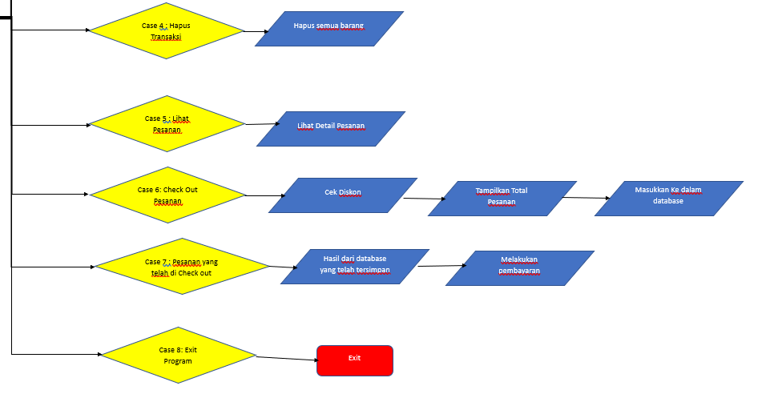

# Self Service Cashier

## Problem Description
Andi adalah pemilik supermarket besar di salah satu kota di Indonesia. Andi berencana memperbaiki proses bisnis dengan membuat sistem kasir swalayan di supermarket miliknya dengan harapan pelanggan bisa langsung menginput barang yang dibeli, jumlah barang yang dibeli, harga barang, dan fitur lainnya. Pelanggan yang tidak berada di kota juga dapat membeli barang dari supermarket.

Setelah melakukan penelitian, Andi menyadari bahwa dia memiliki masalah, yaitu dia membutuhkan seorang programmer untuk membuat fitur-fitur yang diperlukan untuk memastikan kelancaran pengoperasian sistem kasir swalayan di supermarketnya.

Sebagai Software Engineer, peran saya adalah bekerja sama dengan Andi untuk mengumpulkan kebutuhan program kasir swalayan dan memahami kebutuhan spesifiknya. Saya kemudian akan menggunakan keahlian teknis saya untuk merancang dan mengembangkan solusi perangkat lunak yang memenuhi persyaratan ini, menggabungkan fitur yang dibutuhkan Andi untuk supermarketnya.

## Requirement
Untuk memenuhi kebutuhan Andi ini adalah solusinya 

### Technical requirement:
- Membuat program yang kasirnya bisa dilakukan sendiri oleh pembeli
- Program terconnect ke database SQLlite
- Gunakan OOP dan modularisasi untuk memastikan kualitas program
- Terapkan prinsip PEP8 untuk menulis program Python yang bersih
- Tulis dokumentasi untuk setiap fungsi untuk aksesibilitas

### Bussiness requirement:
- Pengguna bisa login atau mendaftar untuk melakukan transaksi
- Pengguna bisa melakukan transaksi sendiri
- Pengguna bisa menambahkan,mengurangi,memperbarui,dan reset(menghapus semua barang) di dalam keranjang virtual yang sudah disediakan
- Pengguna bisa melihat hasil dari transaksi yang telah dilakukan
- Pengguna bisa check out dan akan terekam ke dalam database
- Program kasir ini akan memberikan diskon sesuai total belanjaan yang telah di terapkan
    - 7% discount if total price > Rp 500.000
    - 6% discount if total price > Rp 300.000
    - 5% discount if total price > Rp 200.000

## Flowchart

## Test Case Scenario
Untuk melihat hasil test dari percobaan tersebut silahkan klik disini [link](test-case/test.MD)

## Conclusion/Future Work
Program CLI sederhana ini adalah barang yang cukup bagus yang membuat saya meninjau keterampilan pemrograman dasar saya dan bahkan mempelajari beberapa hal baru.
Berikut adalah beberapa hal yang dapat dilakukan untuk meningkatkan program ini untuk pekerjaan di masa mendatang:
1. Terapkan arsitektur bersih dan prinsip S.O.L.I.D untuk pendekatan yang lebih bersih dan lebih kuat
2. Tulis lebih banyak validasi
3. Fungsi refactor untuk efisiensi lebih
4. program Dockerisasi
