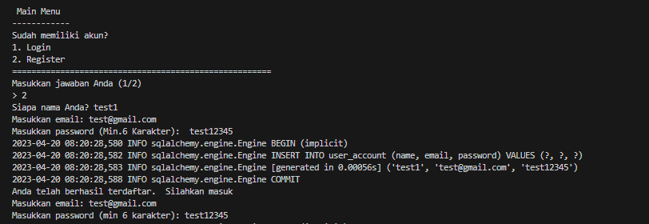
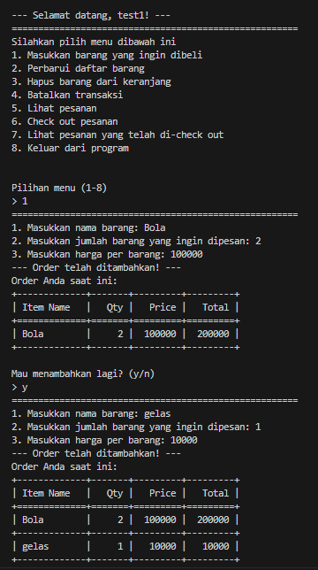
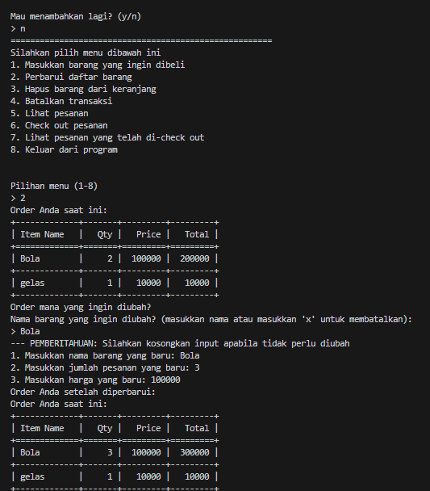
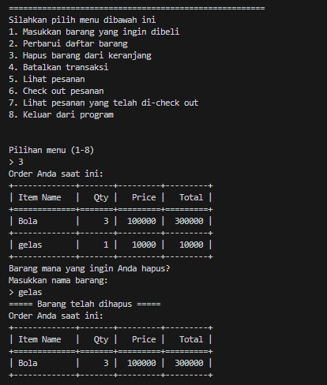
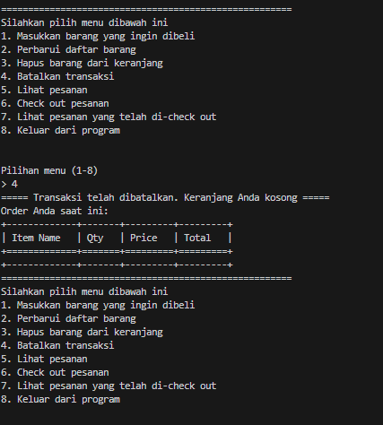
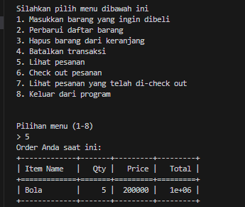
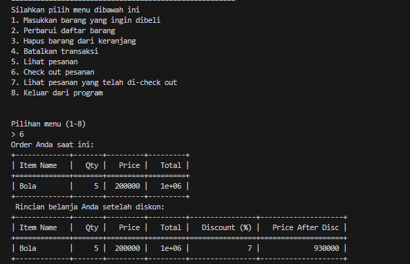
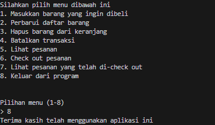

# Test Case Scenario
1. Authentication test
    - Register and Login
    

2. Transaction test
    - Pengguna Menambahkan barang

        

    - Pengguna bisa mengubah barang
       - Hanya untuk contoh ini hanya mengubah Qty(jumlah barang)
        

    - Pengguna bisa menghapus barang

        

    - Pengguna bisa menghapus semua transaksi

        

    - Pengguna bisa mengecek hasil transaksi
    
        

    - Pengguna bisa check out transaksi 

        

    - Pengguna bisa keluar dari program

        
